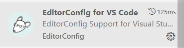
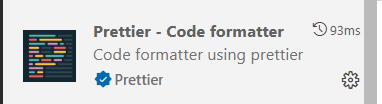

### React + Vite 项目开发流程详解（基于 `react_vite2` 模板）

---

## 一、项目初始化与依赖安装

### 1. 初始化项目

```bash
# 使用 Vite 创建项目
npm create vite@latest react_vite2 --template react-ts

# 进入项目目录
cd react_vite2
```

### 2. 安装核心依赖

```bash
# 安装 React 与 TypeScript
npm install react react-dom typescript @types/react @types/react-dom

# 安装构建工具
npm install vite @vitejs/plugin-react --save-dev
```

### 3. 安装 UI 框架（Ant Design）

```bash
npm install antd @ant-design/icons
```

### 4. 安装 HTTP 请求库（Axios）

```bash
npm install axios
```

### 5. 安装状态管理（Hox）

```bash
npm install hox
```

### 6. 安装 React Hooks 工具库（Ahooks）

```bash
npm install ahooks
```

---

## 二、开发环境配置

### 1. 配置 ESLint + Prettier（代码规范）

```bash
# 安装 ESLint 相关依赖
npm install eslint eslint-plugin-react eslint-plugin-react-hooks eslint-plugin-react-refresh @typescript-eslint/eslint-plugin @typescript-eslint/parser eslint-config-prettier eslint-plugin-prettier prettier --save-dev
```

**配置文件：**

- `.eslintrc`：ESLint 主配置文件
- `.prettierrc`：Prettier 格式化规则

团队开发应保持统一格式，建议使用 vscode，统一使用




插件，配合.editorconfig和.vscode/settings.json配置,以及开启自动保存，这样每次保存代码时都会自动格式化代码。

### 2. 配置 Stylelint（CSS/SCSS/LESS 样式规范）

```bash
npm install stylelint stylelint-config-standard stylelint-config-recess-order stylelint-order stylelint-prettier --save-dev
```

**配置文件：**

- `.stylelintrc`：Stylelint 主配置文件

### 3. 安装 Git 提交规范工具（Commitizen + Husky）

```bash
npm install husky lint-staged commitizen cz-customizable @commitlint/cli @commitlint/config-conventional --save-dev
```

**配置步骤：**

1. 启用 Husky：
   ```bash
   npx husky install
   ```
2. 添加提交钩子（commit-msg）：
   ```bash
   npx husky add .husky/commit-msg 'npx --no-install commitlint --edit "$1"'
   ```
3. 设置提交模板（[package.json](file://e:\products\vite2_react\package.json)）：
   ```json
   "config": {
     "commitizen": {
       "path": "./node_modules/cz-customizable"
     }
   }
   ```

---

## 三、开发流程

### 1. 启动开发服务器

```bash
npm run dev
```

### 2. 开发目录结构

```
/react_vite2
├── src/
│   ├── components/         # 公共组件
│   ├── pages/              # 页面组件
│   ├── hooks/              # 自定义 Hooks（使用 ahooks）
│   ├── stores/             # 状态管理（使用 hox）
│   ├── utils/              # 工具函数
│   ├── App.tsx             # 根组件
│   └── main.tsx            # 入口文件
```

### 3. 模块开发示例

#### (1) 状态管理模块（使用 Hox）

```ts
// src/stores/useCounterStore.ts
import { createHook } from 'hox'

const useCounterStore = createHook(() => {
  const [count, setCount] = useState(0)
  const increment = () => setCount(count + 1)
  const decrement = () => setCount(count - 1)

  return { count, increment, decrement }
})

export default useCounterStore
```

**使用方式：**

```tsx
// src/pages/CounterPage.tsx
import useCounterStore from '../stores/useCounterStore'

const CounterPage = () => {
  const { count, increment, decrement } = useCounterStore()

  return (
    <div>
      <p>Count: {count}</p>
      <button onClick={increment}>+</button>
      <button onClick={decrement}>-</button>
    </div>
  )
}
```

#### (2) 网络请求模块（使用 Axios）

```ts
// src/utils/request.ts
import axios from 'axios'

const service = axios.create({
  baseURL: '/api',
  timeout: 5000
})

export default service
```

```ts
// src/api/homeApi.ts
import service from '../utils/request'

export const getHoxData = () => {
  return service.get('/getHoxData')
}
```

#### (3) 路由配置（React Router v7）

```ts
// src/App.tsx
import { BrowserRouter, Routes, Route } from 'react-router-dom';
import HomePage from './pages/HomePage';
import CounterPage from './pages/CounterPage';

const App = () => (
  <BrowserRouter>
    <Routes>
      <Route path="/" element={<HomePage />} />
      <Route path="/counter" element={<CounterPage />} />
    </Routes>
  </BrowserRouter>
);
```

---

## 四、代码质量保障

### 1. 提交前检查（lint-staged）

```json
"lint-staged": {
  "src/**/*.{js,jsx,ts,tsx}": [
    "eslint --fix",
    "prettier --write"
  ],
  "src/**/*.{css,scss,less}": [
    "stylelint --fix",
    "prettier --write"
  ]
}
```

### 2. 规范提交信息（使用 Commitizen）

```bash
git add .
git cz
```

---

## 五、构建与部署

### 1. 构建生产环境

```bash
npm run build
```

### 2. 预览构建结果

```bash
npm run preview
```

---

## 六、可选模块说明

| 模块名                   | 用途             | 安装命令                                       |
| ------------------------ | ---------------- | ---------------------------------------------- |
| **Mock 数据支持**        | 接口模拟         | `npm install mockjs vite-plugin-mock`          |
| **CSS 预处理器（Less）** | 支持 Less 样式   | `npm install less stylelint-less`              |
| **CSS 规范排序**         | 样式顺序检查     | `npm install stylelint-order`                  |
| **TypeScript 检查增强**  | 更严格的 TS 检查 | `npm install @typescript-eslint/eslint-plugin` |

---

## 七、开发流程总结图

```
1. 初始化项目
2. 安装基础依赖（React + Vite + TypeScript）
3. 安装 UI 框架（Ant Design）
4. 安装状态管理（Hox）
5. 安装网络请求（Axios）
6. 配置代码规范（ESLint + Prettier + Stylelint）
7. 配置 Git 提交规范（Husky + Lint-staged + Commitizen）
8. 开发模块（组件 + Hooks + 状态管理 + API）
9. 提交代码（git cz）
10. 构建部署（npm run build）
```

---

## 八、安装jest

jest 是一个测试框架，用于测试 JavaScript 代码。它允许你使用各种测试风格，如 TDD 或 BDD。
jest 默认情况下，它将自动查找并运行所有以 .test.js 或 .spec.js 结尾的文件。
由于vite项目是esModule，所以需要安装babel相关插件以及在vite配置文件中配置babel（vite项目本身默认支持esModule，所以不需要配置babel）

### 安装依赖

```sh
pnpm install jest @types/jest identity-obj-proxy
pnpm install @babel/preset-env @babel/preset-react @babel/preset-typescript
pnpm install @testing-library/jest-dom @testing-library/react

pnpm i jest@27 ts-jest@27 @types/jest@27 -D
pnpm i @babel/core @babel/preset-env -D
pnpm i babel-jest@27.0.6 -D
```

### 根目录新建 jest.config.js

```js
module.exports = {
  testEnvironment: 'jsdom',
  testMatch: [
    '**/?(*.)+(spec|test|unit).[jt]s?(x)' // 匹配单元测试文件
  ],
  transform: {
    '^.+\.[j|t]sx?$': 'babel-jest',
    '^.+\.tsx$': 'ts-jest'
  }
}
```

### 根目录新建 babel.config.cjs（使用cjs是因为避免使用js不支持import）

```js
const { pathsToModuleNameMapper } = require('ts-jest')
const { compilerOptions } = require('./tsconfig.app.json')
// compilerOptions 映射路径,可以在test中使用别名,如果jest文件不使用别名，不需要引入tsconfig.app.json

const obj = {
  clearMocks: true,
  collectCoverage: true,
  coverageDirectory: 'coverage',
  coverageProvider: 'v8',
  testEnvironment: 'jsdom',
  moduleNameMapper: {
    ...pathsToModuleNameMapper(compilerOptions.paths, {
      prefix: '<rootDir>/'
    }),
    '^.+\\.(css|less)$': 'identity-obj-proxy'
  }
}

module.exports = obj
```

### package.json文件配置

```json
"scripts": { ..."test": "jest" }
```

### utils下创建math.ts文件，**test**下创建math.test.ts文件

### 运行测试用例

```
npm run test
npm run test:coverage
```

## 如何在vscode中使用xxlint，以jsonLint为例

### 1. 安装jsonLint插件（esLint，prettier同理）

### 2. 创建.vscode文件夹，在里面创建settings.json文件，并添加相应内容，以jsonLint为例

```json
  "jsonlint.validate": true,
  "jsonlint.rcConfig": true,
  "jsonlint.options": {
    "indent": 2,
    "colorize": true
  },
  "json.validate.enable": true,
  ----------------以上为jsonLint的配置项，可自行添加-----------------
  -----------------以下为保存格式化等，可自行添加-----------------
  "editor.codeActionsOnSave": {
    "source.fixAll": true
  }
```

### 3.添加.jsonlintrc 配置文件

```json
{
  "indent": 2,
  "colorize": true,
  "validate": true
}
```

### 4.保存文件时，即可自动格式化
